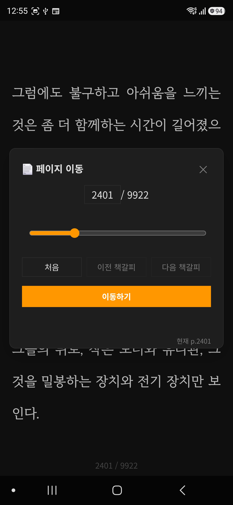
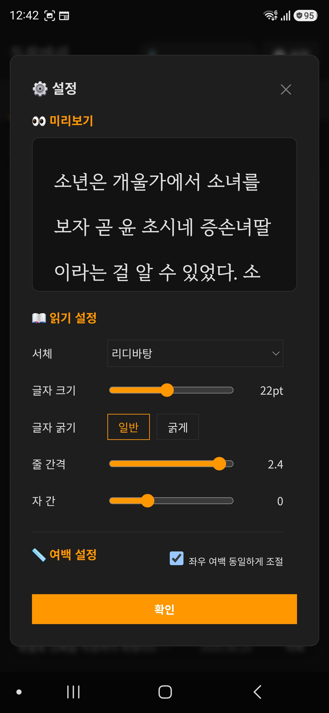
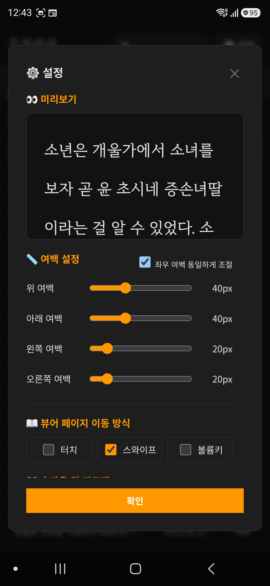
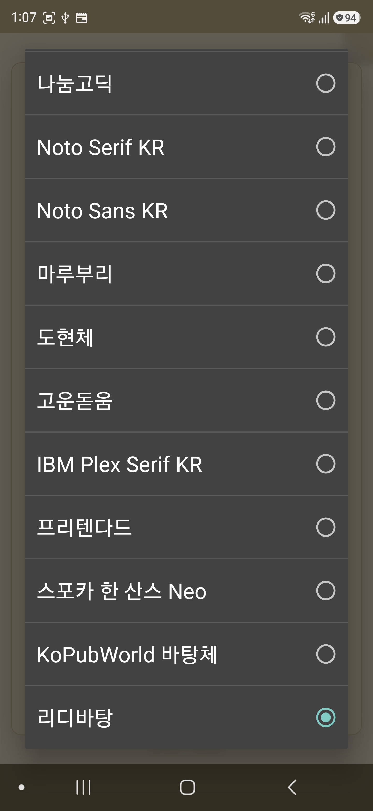
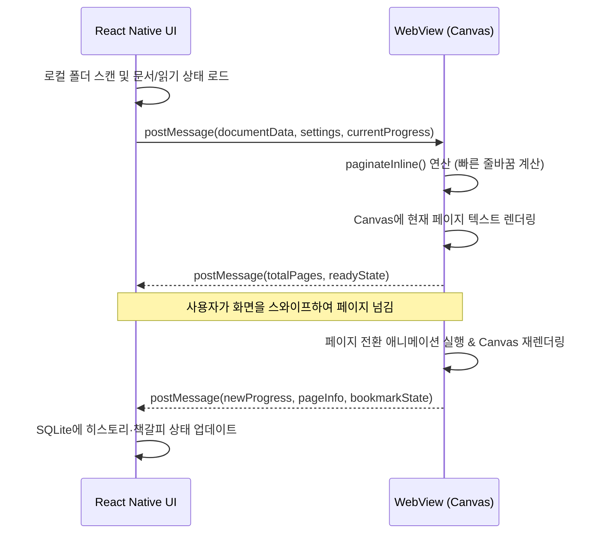

# 두루마리(Durumari) React Native 하이브리드 앱 PRD 및 아키텍처 설계

## 1. 개요 (Product Overview)
기존 웹 기반 하이브리드 앱으로 개발되었던 '두루마리(Durumari)' 텍스트 뷰어 앱을 **React Native** 기반으로 재개발합니다. UI 영역은 100% React Native로 구현하여 네이티브 수준의 속도, 안정성 및 부드러운 화면 전환을 달성하고, 텍스트 뷰어 영역은 웹뷰(WebView) 내 **HTML5 Canvas**를 활용하여 성능과 텍스트 렌더링 정확도를 극대화합니다.

## 2. 목표 (Goals)
* **속도 및 안정성:** React Native UI를 통한 즉각적인 로딩 및 극도로 부드러운 스크롤/화면 전환 경험 제공.
* **뷰어 성능 향상:** DOM 렌더링 방식에서 벗어나 Canvas를 통한 직접 렌더링으로 페이지 전환 속도 및 메모리 효율성 극대화.
* **자연스러운 애니메이션:** 네이티브 레벨의 탭 전환 및 뷰어 내 부드러운 페이지 넘김 모션(Swipe, Curl 등) 구현.
* **시스템 폴더 동기화:** 안드로이드 시스템의 로컬 폴더(SAF - Storage Access Framework) 스캔 및 파일 접근을 네이티브 방식으로 자연스럽게 연동.

## 3. 기능 범위 (Scope)
* **포함 (In-Scope):**
  * 인트로/스플래시 및 문서 페이지 계산 로딩 화면 (네이티브 스플래시 연동)
  * 로컬 폴더 스캔 및 파일 목록 뷰 (안드로이드 파일 시스템 완벽 연동)
  * 최근 읽은 목록(History) 및 책갈피(Bookmarks) 관리
  * 뷰어 설정 메뉴 (글꼴, 폰트 크기, 줄 간격, 자간, 테마 변경 등)
  * **Canvas 뷰어 엔진:** 웹뷰 기반 Canvas 텍스트 렌더러 구현 (기존 `paginateInline` 알고리즘 활용)
* **완전 제외 (Out-of-Scope):**
  * **구글 드라이브 연동:** 관련된 모든 UI 및 내부 로직(버튼, 로그인, 동기화)을 완벽하게 제거하고 오직 로컬 폴더로만 관리합니다.

---

## 4. 기능 명세서 (Functional Specification)

### 4.1 스플래시 및 인트로
* 앱 진입 시 스플래시 화면을 노출하며 초기 리소스(설정, 폰트 등) 로딩 대기.
* 로딩 완료 시 부드러운 페이드아웃 효과와 함께 메인 화면(라이브러리 탭)으로 진입.
* **문서 열기 로딩:** 스플래시와 별도로, 선택한 문서의 페이지를 계산하는 동안 두루마리 일러스트, 앱명, 진행 바 및 `전체 페이지를 계산하는 중… n%` 상태를 표시한다. 계산이 끝나면 마지막 읽기 위치(없으면 첫 페이지)로 뷰어를 연다.

### 4.2 내 서재 (Library) - 로컬 폴더 전용
* **화면 구조:** 목록 탭 상단에 현재 폴더의 제목 검색 입력창과 설정 버튼을 둔다. 본문은 `목록 / 히스토리 / 책갈피` 탭으로 전환하며, 선택 탭은 오렌지색 텍스트와 하단 인디케이터로 표시한다.
* **폴더 추가:** `+ 추가`를 누르면 로컬 폴더 등록 다이얼로그를 연다. 다이얼로그는 로컬 폴더 선택 버튼, 선택 경로, 폴더 표시명, 닫기(X), 등록 버튼으로 구성한다. 등록 버튼은 유효한 SAF 폴더 권한·경로·표시명이 모두 있을 때만 활성화한다. 취소 또는 X는 변경 없이 닫는다.
* **로컬 전용:** 구글 드라이브 선택 탭·아이콘·로그인·동기화 로직은 제공하지 않는다.
* **폴더 동기화 및 변경 감지:** 등록한 폴더의 `.txt`, `.epub`, `.zip`, `.gz` 파일을 읽어 목록에 표시한다. 하위 폴더 스캔은 v1에서 지원하지 않는다. SAF `content://` 트리에는 Expo 파일 감시자를 사용할 수 없으므로 앱 시작과 포그라운드 복귀 시 전체 등록 폴더를 재스캔한다. 앱이 계속 포그라운드인 동안 외부에서 바뀐 파일이나 SAF 제공자가 변경 정보를 늦게 반영하는 경우를 위해 수동 `재동기화`를 유지한다.
* **변경 반영 규칙:** 새 파일은 목록에 추가한다. 이름 또는 경로가 바뀐 파일은 콘텐츠 지문이 같으면 기존 `documentId`와 읽기 상태·책갈피를 유지한 채 메타데이터만 갱신한다. 삭제된 파일 또는 아카이브에서 사라진 내부 항목은 목록에서 즉시 제거하고, 연결된 히스토리와 책갈피도 같은 트랜잭션으로 삭제한다. 권한 오류나 일시적 스캔 실패는 삭제로 처리하지 않고 `동기화 실패` 상태와 재시도 동작을 표시한다.
* **목록 표:** 등록 폴더는 제거 가능한 폴더 칩으로 표시한다. 최초에는 첫 번째 폴더를 선택하고 이후에는 설정에 저장한 마지막 선택 폴더를 복원한다. 목록 열은 `제목 / 파일 일자 / 상태`이며, 상태는 아래의 읽기 상태 판정 규칙에 따라 `미독`, `읽는 중`, `완독`으로 표시한다. 제목은 한 줄 말줄임 처리한다. 기본 정렬은 파일 일자 내림차순이며 제목·파일 일자·상태 헤더를 눌러 오름/내림차순을 전환한다. 검색은 현재 선택 폴더 안의 문서 제목만 대상으로 한다.
* **읽기 상태 판정:**
  * **미독:** 문서를 열어보지 않았거나, 마지막 저장 페이지가 1페이지인 경우. 문서를 처음 열어 1페이지를 표시한 것만으로는 읽는 중으로 바꾸지 않는다.
  * **읽는 중:** 마지막 저장 페이지가 2페이지 이상이고 전체 페이지보다 작은 경우.
  * **완독:** 사용자가 마지막 페이지에 실제로 도달한 경우. 마지막 페이지가 1페이지인 단일 페이지 문서는 최초 표시만으로 완독 처리하지 않으며, 페이지 끝 도달을 확정하는 읽기 완료 이벤트가 있을 때 완독 처리한다.
  * 페이지 재계산으로 전체 페이지 수가 바뀌면 저장된 진행률로 마지막 페이지를 다시 산출한 뒤 상태를 재판정한다. 완독 문서를 다시 열어 이전 페이지로 이동해도 완독 상태는 유지하며, 사용자가 명시적으로 읽기 상태를 초기화할 때만 미독으로 되돌린다.
* **상태 색상:** 상태 레이블과 히스토리의 진행률 값은 테마별 의미 색상 토큰을 사용한다. `미독`은 보조 텍스트색, `읽는 중`은 강조색, `완독`은 완료색으로 표시한다. 본문 제목·파일 일자는 기본 텍스트색을 유지하므로 상태만 색으로 구분한다. 색상은 텍스트 대비 4.5:1 이상을 만족해야 한다.
  * 다크: 미독 `#A8A8A8`, 읽는 중 `#FF9D00`, 완독 `#72C48A`
  * 화이트: 미독 `#666666`, 읽는 중 `#B85C00`, 완독 `#217A3C`
  * 한지: 미독 `#6F6856`, 읽는 중 `#9A5A10`, 완독 `#476B3C`
* **지원 형식 및 파싱 규칙:**
  * 일반 텍스트는 `.txt`를 지원한다. UTF-8(BOM 포함), UTF-16 LE/BE, EUC-KR, CP949를 순서대로 감지하고, 감지에 실패하면 UTF-8로 열되 사용자가 인코딩을 다시 선택할 수 있게 한다.
  * EPUB은 DRM이 없는 reflowable EPUB 2/3을 지원한다. spine 순서의 텍스트 챕터를 읽어 하나의 연속된 읽기 흐름으로 만들며, 목차는 챕터 이동에 사용한다. 고정 레이아웃 EPUB, DRM EPUB, 오디오/비디오·스크립트 중심 EPUB은 지원하지 않고 읽기 불가 사유를 표시한다.
  * `.zip`은 내부의 지원 문서(`.txt`, `.epub`)를 지원한다. 압축 파일 안에 여러 문서가 있으면 각 항목을 별도 도서로 표시하고, 표에는 원본 압축 파일명을 보조 정보로 보관한다. `.gz`는 단일 `.txt`만 지원한다. EPUB 자체는 ZIP 컨테이너이므로 별도 압축 해제 대상이 아니라 EPUB 파서로 처리한다.
  * 중첩 압축 파일, 암호화 ZIP/GZIP, 손상된 아카이브, 지원하지 않는 확장자(`.rar`, `.7z`, `.pdf`, `.docx`)는 v1에서 지원하지 않는다.
  * 안전 한도는 압축 파일당 100 MB, 압축 해제 후 총 500 MB, 항목 2,000개, 압축률 100:1 이하로 제한한다. 한도를 넘거나 경로 탐색(`../`) 항목이 있으면 열지 않고 사유와 함께 건너뛴다.

### 4.3 최근 읽은 목록 (History) 및 책갈피 (Bookmarks)
* **히스토리:** 문서를 열거나 페이지를 이동할 때 마지막 페이지, 전체 페이지, 진행률, 마지막 읽은 시각, 읽기 완료 여부를 저장한다. 히스토리 탭은 `폴더 / 제목 / 읽은 일자 / 진행률` 열로 표시하고, 기본 정렬은 읽은 일자 내림차순이다. 진행률은 정수 백분율로 표시하며 읽기 상태 판정과 동일한 테마별 의미 색상을 적용한다. 100%만으로 완독을 판단하지 않고, 마지막 페이지 도달 이벤트로 기록된 읽기 완료 여부를 함께 사용한다.
* **책갈피:** 뷰어에서 현재 페이지의 책갈피를 토글한다. 저장 값은 문서 식별자, 페이지 번호, 전체 페이지 수, 진행률, 추가 시각, 해당 페이지 첫 문장의 요약 텍스트다. 책갈피 탭은 `폴더 / 제목 / 추가 일자 / 위치` 열로 표시하며 위치는 `p.{페이지번호}` 형식이다. 항목을 누르면 해당 문서를 열고 저장한 페이지로 이동한다.
* **필터 및 빈 상태:** `완독한 책 목록에서 숨김`은 목록 탭에만 적용하며 히스토리와 책갈피는 숨기지 않는다. 각 탭은 데이터가 없을 때 탭 목적에 맞는 빈 상태 안내를 표시한다.

### 4.4 캔버스 뷰어 (Canvas Viewer)
* **텍스트 처리:** 파일 크기에 구애받지 않도록 `TextReader` 알고리즘 기반 빠른 페이징 연산 처리 (`paginateInline`).
* **캔버스 렌더링:** 한 페이지 분량의 텍스트가 정해지면, HTML5 `<canvas>`의 `fillText`를 사용하여 줄 단위로 직접 렌더링.
* **페이지 넘김 조작 (Navigation):**
  * **Android 필수 입력:** 화면 가장자리 터치, 스와이프, 볼륨 키(설정에서 활성화한 방식만)를 통해 페이지 이동을 감지한다.
  * **웹/데스크톱 보조 입력:** 방향키, 스페이스바, ESC, 마우스 오른쪽 버튼, 마우스 휠(위: 이전 페이지, 아래: 다음 페이지)을 지원한다.
  * 진동 또는 사운드 피드백은 설정값에 따라 제공하며, OS 권한·기기 지원 여부에 따라 사용할 수 없으면 조용히 생략한다.
  * 페이지 넘김 소리는 기존 정적 wav 파일을 우선 사용하지 않고, 코드로 합성한 짧은 효과음을 기본값으로 사용한다. 정적 오디오 파일은 합성 API가 실패하는 환경에서만 선택적 fallback으로 둔다.
* **뷰어 팝업 메뉴:**
  * **호출 방식:** 화면 터치 홀드(길게 누르기), 키보드 ESC 키, 마우스 오른쪽 버튼 클릭 시 출력.
  * **메인 팝업 UI:** 상단에 책 제목, 현재 읽는 중인 진행 상태(현재 페이지/전체 페이지 수, 오렌지색 진행 바)와 닫기(X) 버튼 표출. 중앙에 2x2 배열로 버튼 배치 (책갈피, 페이지 이동, 설정, 목록 나가기).
    
  * **페이지 이동 (내비게이션) 팝업 UI:**
    
    * 특정 페이지 번호 입력 및 표시 (예: `2401 / 9922`) 및 닫기 버튼.
    * 원하는 위치로 드래그할 수 있는 진행률 슬라이더 바 제공.
    * '처음', '이전 책갈피', '다음 책갈피' 위치로 즉시 설정하는 3개의 빠른 조작 버튼.
    * 최종적으로 위치를 확정하여 넘어가는 '이동하기' 대형 확정 버튼 표출.
* **책갈피 UI (상태 표시):**
  
  * 뷰어 우측 상단에 '책장 모서리가 접혀 있는(Dog-ear)' 모양의 UI로 현재 페이지 책갈피 여부를 시각적으로 표시.
  * 색상 조합은 현재 사용 중인 디스플레이 테마(종이색, 다크모드 등)에 맞추어 이질감 없이 렌더링.
* **모션 및 애니메이션 (페이지 전환 효과):**
  * **페이지 레이어 불투명 원칙:** 슬라이드와 책장 넘김 전환에 사용되는 현재 페이지, 다음 페이지, 접힌 페이지, 임시 캡처 캔버스는 모두 불투명하게 렌더링한다. 전환 중 페이지 레이어의 `opacity`를 낮춰 뒤 페이지 텍스트가 비치게 만들면 안 된다. 페이드 효과 대신 위치 이동, 마스크, 클리핑, 그림자, 하이라이트로만 깊이감을 표현한다.
  * **배경 채움:** 각 페이지 레이어는 현재 테마의 종이/배경색으로 먼저 전체 영역을 채운 뒤 텍스트를 그린다. 캔버스 투명 배경, CSS `rgba()` 반투명 배경, 전환용 이미지의 알파 채널 때문에 아래 레이어가 보이는 상태를 허용하지 않는다.
  * **첫장/끝장 경계 피드백:** 첫 페이지에서 이전 페이지 이동을 시도하거나 마지막 페이지에서 다음 페이지 이동을 시도하면 페이지 번호와 읽기 상태를 변경하지 않는다. 시각적 피드백 방식은 선택한 페이지 전환 효과에 따라 다르게 처리한다.
    * 슬라이드 모션에서는 현재 페이지를 이동 방향으로 8~16px 정도 밀었다가 120~180ms 안에 원위치로 되돌린다. 다음/이전 페이지 레이어를 새로 만들거나 빈 페이지를 보여주지 않는다.
    * 책장 넘김 모션에서는 페이지 자체를 움직이지 않는다. 오른쪽 아래 모서리 미세 curl, 큰 접힘, 빈 뒷장 노출을 모두 표시하지 않으며 현재 페이지를 그대로 유지한다.
    * 피드백은 과하지 않게 1회만 발생하며, 연속 입력 시 300ms 이내에는 중복 재생하지 않는다. 설정이 `진동`이면 짧은 약진동을 1회 제공하고, `소리`이면 일반 책장 넘김 소리보다 작고 짧은 “막힘/끝” 피드백음을 코드로 합성한다.
    * 화면 하단에는 1.2초 이하의 작은 토스트를 표시한다. 첫 페이지에서는 `첫 페이지입니다`, 마지막 페이지에서는 `마지막 페이지입니다`를 사용한다. 토스트는 현재 테마 색상과 대비 기준을 따르며 본문을 가리지 않도록 안전 영역 위에 배치한다.
    * 마지막 페이지에서 다음 이동을 시도하는 동작은 완독 이벤트로 간주하지 않는다. 완독은 사용자가 실제 마지막 페이지에 도달했을 때만 기록한다.
  * **슬라이드 모션:**
    * 입력 키/조작에 맞게 방향 처리 (좌/위, 우/아래).
    * **다음 페이지:** (우→좌, 하→상 방향) 다음 페이지가 슬라이드 되어 들어오며 현재 페이지 위를 덮음.
    * **이전 페이지:** (좌→우, 상→하 방향) 현재 보고 있는 페이지가 해당 방향으로 슬라이드 되어 밀려 나가며 아래에 깔려있던 이전 페이지가 노출됨.
  * **책장 넘김 (Curl) 모션:**
    * **기본 모델:** 화면의 왼쪽 경계는 실제 책의 가운데 제본부/회전축으로 간주한다. 사용자가 책의 오른쪽 페이지를 보고 있으며, 오른쪽 아래 모서리를 손으로 잡아 왼쪽 제본부 방향으로 넘기는 상황을 기준으로 구현한다. 즉, `왼쪽 = 책의 중심축`, `오른쪽 아래 = 사용자가 잡는 페이지 모서리`다.
    * **다음 페이지:** 현재 페이지는 왼쪽 제본부를 기준으로 연결된 상태를 유지하면서, 오른쪽 아래 모서리부터 들려 올라가 왼쪽 위/왼쪽 안쪽 방향으로 넘어간다. 접힌 종이의 조작점은 오른쪽 아래 → 중앙 하단/중앙 우측 → 왼쪽 제본부 근처로 이동하며, 아래에 있는 다음 페이지가 점진적으로 노출된다.
    * **이전 페이지:** 왼쪽 제본부에서 이미 넘어갔던 장이 다시 오른쪽으로 펼쳐지는 느낌으로 처리한다. 단순 슬라이드 역방향이 아니라, 책의 가운데 축에 붙어 있던 페이지가 다시 펴지며 현재 페이지 위로 자연스럽게 덮이는 동작이어야 한다.
    * **형태/그림자:** 접힌 영역은 삼각형 또는 곡면에 가까운 마스크로 표현하고, 접힌 면에는 종이 뒷면 색과 부드러운 그라데이션을 적용한다. 접힘 경계에는 얇은 하이라이트, 접힌 페이지 아래에는 방향성 그림자를 넣어 실제 종이가 들리는 느낌을 만든다.
    * **타이밍:** 기본 지속 시간은 280~420ms 범위로 하며, 터치/스와이프 속도에 따라 가속도를 반영한다. 너무 기계적인 선형 보간은 피하고 `easeOutCubic` 또는 유사한 감속 곡선을 사용한다.
    * **취소/역전:** 사용자가 넘김 도중 반대 방향으로 끌거나 임계값 미만으로 놓으면 페이지가 오른쪽 아래 모서리부터 원래 위치로 자연스럽게 복귀한다. 볼륨키·탭처럼 드래그 좌표가 없는 입력은 왼쪽 제본부를 축으로, 오른쪽 아래 모서리를 잡고 넘기는 표준 자동 curl 애니메이션을 실행한다.
  * **코드 기반 책장 넘김 효과음:**
    * wav/mp3 같은 정적 리소스에 의존하지 않고, WebView에서는 Web Audio API로 짧은 합성음을 생성한다. 네이티브 구현이 필요한 경우에도 동일한 파라미터를 가진 합성 오디오 엔진 또는 런타임 생성 버퍼를 사용한다.
    * 효과음은 실제 종이가 넘어가는 소리에 가깝게 `짧은 마찰음 + 가벼운 플랩음 + 잔향 없는 감쇠`로 구성한다.
      * 마찰음: white/pink noise를 120~260ms 동안 재생하고, band-pass 필터를 약 600~3500Hz 범위에서 빠르게 이동시켜 종이 섬유가 스치는 질감을 만든다.
      * 플랩음: 끝나는 지점에 30~70ms의 낮은 대역 transient를 작게 섞어 종이가 내려앉는 느낌을 준다.
      * 볼륨: 기본 피크는 기기 미디어 볼륨 대비 과하지 않게 제한하고, 반복 페이지 넘김 시 귀에 거슬리지 않도록 부드러운 attack/release envelope를 적용한다.
    * 페이지 넘김 방향과 속도에 따라 소리를 미세 조정한다. 빠른 넘김은 마찰음 길이를 짧고 밝게, 느린 넘김은 길고 낮게 만든다. 이전 페이지는 다음 페이지보다 플랩음을 약하게 처리한다.
    * 소리 설정이 `소리`일 때만 재생하고, `진동` 또는 `없음`에서는 재생하지 않는다. 사용자가 시스템 무음/방해금지/오디오 포커스 제한 상태인 경우에는 조용히 생략한다.

### 4.5 설정 팝업 UI 및 상태 관리 (Settings)
설정 화면은 스크롤 가능한 팝업으로 제공된다. 팝업을 열 때 저장된 설정을 임시 편집본으로 복제한다. 임시값은 미리보기에 즉시 반영하지만 실제 뷰어와 저장소에는 반영하지 않는다. 하단의 **[확인]** 버튼을 누르면 임시값을 저장하고 실제 뷰어를 재페이징·재렌더링한다. X 버튼이나 배경 터치로 닫으면 임시 변경을 모두 폐기한다.

* **설정 화면 스크린샷:**
  
  
  
  

* **미리보기 (Preview) 영역:**
  * 팝업 최상단에 샘플 텍스트가 담긴 미리보기 박스 노출.
  * 하위 메뉴에서 변경하는 **'읽기 설정', '여백 설정', '테마'** 항목은 뷰어에 즉각 반영되지 않고 이 '미리보기' 상자에 실시간 렌더링되어 피드백을 제공.
* **상세 설정 항목 (스크롤 제공):**
  1. **읽기 설정:**
     * 서체(글꼴) 드롭다운 (기존 `durumari-android-app` 에셋 완벽 이식: 리디바탕, 나눔고딕 등)
       
     * 글자 크기 (슬라이더 바, pt 단위) / 글자 굵기 (일반/굵게 토글) / 줄 간격 (슬라이더 바) / 자간 (슬라이더 바)
  2. **여백 설정:**
     * '좌우 여백 동일하게 조절' 체크박스
     * 위/아래/왼쪽/오른쪽 여백 개별 슬라이더 바 (px 단위)
  3. **뷰어 페이지 이동 방식:** 터치, 스와이프, 볼륨키 (다중 선택 체크박스)
  4. **효과음 및 피드백:** 없음, 진동, 소리 (단일 선택 라디오 버튼)
  5. **뷰어 페이지 애니메이션 방식:** 없음, 책장 넘김, 슬라이드 (단일 선택 라디오 버튼)
  6. **테마 및 필터:**
     * 테마: 화이트, 다크, 한지 (버튼형 토글)
     * 필터: '완독한 책 목록에서 숨김' 체크박스
  7. **데이터 및 설정 관리:**
     * **설정 초기화:** 전역 뷰어/목록 설정만 기존 `durumari-android-app`의 기본 설정값으로 되돌린다. 폴더 등록 정보, 문서 인덱스, 히스토리, 책갈피는 삭제하지 않는다.
       * 기본값: 서체 `NanumMyeongjo, 'Malgun Gothic', serif`, 글자 크기 `18pt`, 글자 굵기 `일반`, 줄 간격 `1.6`, 자간 `0px`.
       * 여백 기본값: 위 `40px`, 아래 `40px`, 왼쪽 `20px`, 오른쪽 `20px`, `좌우 여백 동일하게 조절` 켬.
       * 페이지 이동 기본값: 터치 켬, 스와이프 켬, 볼륨키 켬.
       * 피드백/애니메이션 기본값: 페이지 넘김 피드백 `진동`, 페이지 애니메이션 `책장 넘김`.
       * 테마/필터 기본값: 테마 `한지(paper)`, `완독한 책 목록에서 숨김` 꺼짐.
       * 정렬 기본값: 목록 `읽은 일자(openedAt) 내림차순`, 히스토리 `읽은 일자(openedAt) 내림차순`, 책갈피 `추가 일자(createdAt) 내림차순`.
       * 실행 전 확인 다이얼로그를 표시하고, 확인 시 현재 설정 팝업의 임시 편집본도 기본값으로 갱신한다. 사용자가 X/배경 터치로 닫으면 초기화 적용 전 상태로 되돌린다.
     * **폴더 해제:** 폴더 칩 또는 폴더 관리 화면에서 개별 폴더를 해제할 수 있다. 실제 안드로이드 시스템 폴더와 원본 파일은 삭제하지 않지만, 앱 내부의 해당 폴더 문서 인덱스·히스토리·책갈피·읽기 위치·완독 상태는 같은 트랜잭션으로 모두 삭제한다.
     * **폴더 전체 해제:** 버튼은 경고색/레드로 표시한다. 등록된 모든 폴더를 해제하며, 실제 파일은 삭제하지 않는다. 앱 내부의 모든 폴더 문서 인덱스·히스토리·책갈피·읽기 위치·완독 상태를 같은 트랜잭션으로 삭제하고, 현재 열려 있는 문서가 해제 대상이면 뷰어를 닫고 목록 탭으로 이동한다.
     * 폴더 해제와 폴더 전체 해제는 데이터 손실 범위를 명시한 확인 다이얼로그를 반드시 거친다. 삭제 처리 중 실패하면 부분 삭제를 남기지 않도록 트랜잭션을 롤백하고 `폴더 해제에 실패했어요. 다시 시도해주세요.`를 표시한다.

### 4.6 데이터 모델 및 수명 주기
* **폴더:** `folderId`, SAF `treeUri`, 표시명, 등록 시각, 마지막 동기화 시각, 권한 상태를 저장한다. 권한이 철회되면 목록에는 유지하되 `접근 권한 필요` 상태로 표시하고, 재권한 부여 또는 폴더 해제를 제공한다.
* **문서:** `documentId`, `folderId`, 원본 URI, 아카이브 내부 항목 경로(해당 시), 제목, 확장자, 파일 크기, 수정 시각, 콘텐츠 지문을 저장한다. 식별자는 `treeUri + 상대 경로 + archiveEntryPath`의 정규화 값으로 만들고, 파일 크기·수정 시각·콘텐츠 지문으로 변경 여부를 판단한다. 폴더별 마지막 성공 동기화 시각·동기화 세대를 저장해 중복 이벤트와 재개 후 재스캔을 안전하게 병합한다.
* **읽기 상태:** `documentId`, 마지막 페이지, 전체 페이지, 진행률, 마지막 읽은 시각, 읽기 완료 여부, 완독 시각을 저장한다. 뷰어 설정·화면 크기·글꼴이 바뀌어 페이지 수가 달라질 경우 기존 진행률을 기준으로 새 페이지를 계산하고 읽기 상태를 다시 판정한다.
* **책갈피:** `bookmarkId`, `documentId`, 페이지 번호, 진행률, 요약 텍스트, 생성 시각을 저장한다. 재페이징 뒤에는 저장된 진행률을 기준으로 가장 가까운 페이지로 재배치한다.
* **삭제 정책:** 폴더 해제는 해당 폴더의 문서 인덱스·히스토리·책갈피·읽기 위치·완독 상태를 모두 삭제하며 확인 다이얼로그를 거친다. 폴더 전체 해제는 등록된 모든 폴더에 동일한 삭제 정책을 적용한다. 파일이 폴더에서 사라진 것으로 성공적으로 확인되면 목록·히스토리·책갈피에서 즉시 영구 삭제한다. 설정 초기화는 전역 설정만 기존 `durumari-android-app` 기본값으로 되돌리며 폴더·문서·히스토리·책갈피는 삭제하지 않는다.

### 4.7 오류, 빈 상태 및 복구 흐름
* 폴더가 비었거나 지원 문서가 없을 때는 `이 폴더에서 읽을 수 있는 문서를 찾지 못했어요.`와 재동기화 버튼을 표시한다.
* 검색 결과가 없을 때는 현재 검색어를 유지한 빈 상태와 검색어 지우기 동작을 제공한다.
* 파일 읽기·인코딩 감지·압축 해제·EPUB 파싱·페이지 계산이 실패하면 원인을 짧게 표시하고 `다시 시도`, `목록으로`를 제공한다. 실패한 파일은 앱 전체를 중단시키지 않는다.
* 페이지 계산 중 취소하거나 다른 화면으로 나가면 진행 중인 작업을 중단하고 부분 결과를 읽기 상태로 저장하지 않는다.
* 지원하지 않는 파일, 암호화 아카이브, 압축 한도 초과, 권한 철회는 각각 구분된 안내 문구와 가능한 해결 행동(다른 파일 선택, 권한 다시 부여, 원본 압축 해제)을 제공한다.

### 4.8 비기능 요구사항 및 보안
* **개인정보:** 문서 본문, 파일명, 폴더 URI, 읽기 이력, 책갈피는 기기 밖으로 전송하지 않는다. 분석·오류 로그에는 원문과 전체 경로를 기록하지 않으며, 필요 시 확장자·크기·오류 코드만 익명화해 기록한다.
* **권한 최소화:** 사용자가 선택한 SAF 폴더 URI에만 지속 접근 권한을 요청한다. 전체 저장소 권한은 요청하지 않으며, 권한 철회·재설치·복원 이후에는 다시 명시적으로 선택받는다.
* **WebView 격리:** WebView는 번들된 로컬 HTML/JS만 로드하며 외부 탐색과 임의 URL 이동을 차단한다. 원문은 HTML로 삽입하지 않고 Canvas 텍스트 입력으로만 전달한다. 브리지 메시지는 허용된 타입·버전·필수 필드를 검증하고, 알 수 없는 메시지는 무시한다.
* **성능 목표:** 30 MB 이하 TXT는 중급 Android 기기에서 문서 열기와 초기 페이지 계산을 5초 이내에 완료한다. 페이지 전환은 95% 구간에서 200 ms 이내에 다음 프레임을 보여 주며, 긴 계산은 진행률을 표시하고 UI 스레드를 차단하지 않는다.
* **접근성 및 화면:** 최소 지원 버전은 Android 10(API 29)이다. 세로 화면을 기본으로 지원하고 화면 회전 시 현재 진행률을 보존해 재페이징한다. 모든 아이콘 버튼에는 접근성 이름을 제공하고, 테마별 본문/배경 대비는 WCAG AA 수준을 목표로 한다. 시스템 글자 크기와 TalkBack 사용 시에도 탭·팝업·확인/취소 동작을 사용할 수 있어야 한다.

---

## 5. 아키텍처 설계 (Architecture Design - Model A)

### 5.1 시스템 구조
* **코어 프레임워크:** React Native (Expo)
* **UI 계층:** React Native 네이티브 컴포넌트
* **뷰어 계층:** `react-native-webview` 내 HTML5 Canvas
* **데이터 저장소:** `expo-sqlite`를 단일 영속 저장소로 사용한다. 폴더 권한 메타데이터, 문서 인덱스, 히스토리, 책갈피, 전역 뷰어 설정을 저장한다.

### 5.2 데이터 흐름 및 통신 설계 (RN ↔ WebView)


### 5.3 RN ↔ WebView 브리지 계약
* 모든 메시지는 `{ version, type, requestId, payload }` 형식을 사용하며, 현재 `version`은 `1`이다. `requestId`로 초기화·설정 변경·페이지 이동 요청과 응답을 연결한다.
* RN → WebView 허용 타입은 `initializeDocument`, `updateSettings`, `goToPage`, `goToOffset`, `toggleBookmark`, `cancelLoading`, `disposeDocument`다. WebView → RN 허용 타입은 `ready`, `pageChanged`, `bookmarkChanged`, `menuRequested`, `loadingProgress`, `error`다.
* `documentData`에는 정규화된 텍스트와 문서 메타데이터만 넣으며, 원본 HTML·외부 URL·실행 가능한 스크립트는 전달하지 않는다. 큰 문서는 한 번의 거대 메시지 대신 청크 또는 WebView 내부의 로컬 리소스 식별자로 전달한다.
* `error` payload는 안정된 오류 코드(`PERMISSION_DENIED`, `UNSUPPORTED_FORMAT`, `ARCHIVE_LIMIT`, `PARSE_FAILED`, `PAGINATION_FAILED`)와 사용자 표시용 메시지 키를 포함한다. 예외 원문·문서 본문·전체 경로는 전달하거나 기록하지 않는다.

---

## 6. User Review Required
> [!IMPORTANT]
> **Expo 프로젝트 생성 방식에 대한 확인**
> 본 프로젝트를 진행하기 위해 로컬(`C:\workspace\durumari-app-v2`)에 새로운 Expo 기반 React Native 프로젝트를 초기화해야 합니다. `npx create-expo-app` 명령어를 통해 최신 환경으로 구성하는 것에 동의하시나요?

> [!WARNING]
> **기존 자산 복사**
> `C:\workspace\durumari-android-app`에 있는 기존 코드 및 리소스(`lib`의 알고리즘, `assets`의 폰트/사운드 등)를 새 프로젝트로 복사 및 가공하여 사용하게 됩니다.

## 7. Verification Plan
* **자동화 확인:**
  * 새 Expo 프로젝트 빌드 및 실행 확인 (`npm run web` 또는 안드로이드 에뮬레이터 연결 시 동작)
  * WebView 내부 Canvas 렌더링 통신 및 페이지 재계산 확인.
  * 목록·히스토리·책갈피의 정렬, 검색, 완독 필터, 빈 상태를 단위 또는 통합 테스트로 검증.
  * TXT 인코딩(UTF-8, UTF-16, EUC-KR, CP949)별 본문 렌더링과 인코딩 감지 실패 시 재선택 흐름을 검증.
  * DRM 없는 reflowable EPUB 2/3, ZIP 내부 TXT/EPUB, GZIP 내부 단일 TXT를 열 수 있는지 검증. 암호화·중첩·손상 아카이브, 경로 탐색 항목, 크기·항목 수·압축률 한도 초과는 안전하게 거부되는지 검증.
  * 브리지 메시지의 허용 타입·버전·필수 필드 검증, 허용되지 않은 외부 URL 이동 차단, 오류 로그의 본문·전체 경로 비포함을 테스트.
* **수동 확인 (사용자 테스트):**
  * 안드로이드 기기/에뮬레이터에서 로컬 폴더를 등록·취소·해제하고 권한 오류 없이 파일 목록이 갱신되는지.
  * 구글 드라이브 관련 UI가 일절 보이지 않는지 확인.
  * 텍스트 뷰어 진입 시 Canvas 화면에서 글자가 깨지지 않고 잘 그려지는지.
  * 페이지 전환 시 부드러운 애니메이션 모션이 발생하는지. 슬라이드와 책장 넘김 전환 중 페이지 레이어가 투명해져 뒤 페이지 텍스트가 비치지 않는지 확인한다. 책장 넘김 모션은 왼쪽 경계를 실제 책의 가운데 제본부/회전축으로 두고, 오른쪽 아래 모서리를 잡아 넘기는 것처럼 대각선으로 말려 올라가는지, 그림자·하이라이트·취소 복귀가 자연스러운지 확인한다.
  * 첫 페이지에서 이전 이동, 마지막 페이지에서 다음 이동을 시도했을 때 페이지 번호가 바뀌지 않고 빈 페이지가 보이지 않는지 확인한다. 슬라이드 모션은 짧은 탄성 복귀를 표시하고, 책장 넘김 모션은 페이지를 움직이지 않은 채 토스트와 설정별 약한 피드백만 표시해야 한다.
  * 소리 피드백을 `소리`로 설정하면 정적 wav 파일이 아니라 코드 기반 합성 책장 넘김 효과음이 재생되는지, 반복 넘김 시 소리가 과하거나 귀에 거슬리지 않는지 확인한다.
  * 설정값을 바꿨을 때 미리보기만 즉시 바뀌고, 확인 시 Canvas가 재페이징·재렌더링되며 X/배경 닫기 시 기존 뷰어 상태가 유지되는지.
  * 설정 초기화를 실행하면 `durumari-android-app` 기본값(나눔명조 18pt, 한지 테마, 진동, 책장 넘김 등)으로 돌아가고, 등록 폴더·히스토리·책갈피는 유지되는지.
  * 개별 폴더 해제와 폴더 전체 해제 시 원본 파일은 유지되고, 해제 대상 문서의 히스토리·책갈피·읽기 위치·완독 상태가 앱 내부에서 함께 삭제되는지.
  * 파일·폴더 삭제, 이름 변경, SAF 권한 철회 및 재부여 뒤에도 적절한 상태·복구 동작이 보이는지.
  * 시스템 파일 앱에서 문서를 추가·수정·이름 변경·삭제한 뒤 앱으로 복귀했을 때 목록이 갱신되고, 삭제된 문서의 히스토리·책갈피가 함께 제거되는지. 앱이 계속 포그라운드인 경우 수동 재동기화로 동일하게 정리되는지.
  * 화면 회전, 시스템 글자 크기 변경, TalkBack, 햅틱 미지원 기기에서 핵심 읽기·탭·팝업·확인/취소 동작을 완료할 수 있는지.
  * 중급 Android 10 기기에서 30 MB 이하 TXT의 초기 페이지 계산이 5초 이내이고, 긴 계산에는 진행률·취소가 제공되며 페이지 전환이 체감상 끊기지 않는지.

## 8. 화면(Screen) 분리 및 컴포넌트 구조
화면, 공통 UI, 전역 상태, 저장소 및 WebView 렌더러의 책임을 분리한다. 현재 앱은 Expo Router를 사용하지 않으며, `App.tsx`의 탭 상태와 `AppContext.activeDocument`를 이용해 화면을 전환한다.

### 8.1 현재 소스 디렉터리

```text
App.tsx                              앱 부팅 및 최상위 화면 전환
src/
├─ screens/
│  ├─ LibraryScreen.tsx              문서 보관함
│  ├─ HistoryScreen.tsx              최근 읽은 문서
│  ├─ BookmarksScreen.tsx            책갈피 목록
│  └─ ViewerScreen.tsx               단일 문서 뷰어 셸
├─ components/
│  ├─ CanvasReader.tsx               RN ↔ WebView 어댑터
│  ├─ IntroScroll.tsx                앱 초기화 화면
│  ├─ SettingsModal.tsx              공통 설정 모달
│  └─ EmptyState.tsx                 공통 빈 상태
├─ contexts/
│  └─ AppContext.tsx                 전역 앱 상태와 목록 갱신 동작
├─ lib/
│  ├─ store.ts                       SQLite 영속 저장소
│  ├─ settings.ts                    기본 설정, 글꼴 및 테마 토큰
│  ├─ safImport.ts                   Android SAF 폴더 선택·재스캔
│  └─ documentImport.ts              파일 선택, 디코딩 및 문서 파싱
├─ viewer/
│  └─ canvasHtml.ts                  WebView Canvas 런타임 생성
└─ types.ts                          공유 도메인 타입과 읽기 상태 판정
```

같은 디렉터리의 `*.test.ts`는 해당 모듈의 단위 테스트다. 생성 산출물인 `dist/`, `android/app/build/` 및 APK는 소스 구조에 포함하지 않는다.

### 8.2 화면별 책임

| 파일 | 입력 및 상태 | 주요 책임 | 직접 의존 계층 |
|---|---|---|---|
| `App.tsx` | `booting`, `tab`, `search`, `settingsOpen`, `AppContext` | 폰트와 저장소 초기화, 포그라운드 재스캔 구독, 검색창·탭·전역 설정 모달 표시, `IntroScroll`/목록 화면/`ViewerScreen` 전환 | `AppContext`, `store`, `safImport`, 공통 컴포넌트와 모든 화면 |
| `src/screens/LibraryScreen.tsx` | `search` prop, 폴더·문서·읽기 상태 | 폴더 칩, 검색·필터·정렬, SAF/파일 가져오기, 폴더 표시명 확정, 개별 폴더 해제, 문서 열기 | `AppContext`, `safImport`, `documentImport`, `store`, `EmptyState` |
| `src/screens/HistoryScreen.tsx` | 문서·히스토리·폴더 맵 | 히스토리 조인, 정렬, 날짜·진행률 표시, 문서 열기 | `AppContext`, `EmptyState` |
| `src/screens/BookmarksScreen.tsx` | 문서·책갈피·폴더 맵 | 책갈피 조인, 정렬, 생성일·페이지 표시, 대상 문서 열기 | `AppContext`, `EmptyState` |
| `src/screens/ViewerScreen.tsx` | `activeDocument`, 설정·읽기 상태·책갈피 | 본문 지연 로드, `CanvasReader` 구성, 읽기 상태 및 책갈피 저장, 페이지·목차·인코딩 이동, 로딩/오류 처리, 뷰어 설정과 종료 | `AppContext`, `CanvasReader`, `SettingsModal`, `store`, `documentImport` |

`App.tsx`는 화면 공통 셸과 전환만 담당한다. 화면 고유 목록 계산, 모달 상태 및 사용자 동작은 각 `Screen`에 둔다. 화면은 SQLite를 직접 다루지 않고 `src/lib/store.ts`의 공개 함수만 호출한다.

### 8.3 상태 소유권과 화면 전환

* **전역 상태 (`AppContext`)**: `settings`, `draftSettings`, `folders`, `documents`, `readings`, `bookmarks`, `activeFolderId`, `activeDocument`를 소유한다. 파생 맵인 `readingsById`, `foldersById`와 `refresh`, `rescanFolders`, `updateSort`도 제공한다.
* **루트 UI 상태 (`App.tsx`)**: 현재 탭, 전체 검색어, 부팅 진행 상태, 메인 설정 모달 열림 여부를 소유한다.
* **화면 로컬 상태**: 가져오기 진행, 화면 전용 모달, 정렬 결과와 뷰어 메뉴·페이지 요청 등 다른 화면에서 공유할 필요가 없는 상태만 각 화면이 소유한다.
* **목록 화면 전환**: `tab` 값이 `library`, `history`, `bookmarks` 중 하나로 바뀌면 대응하는 화면 하나를 렌더링한다.
* **뷰어 진입/종료**: 목록에서 문서를 선택해 `activeDocument`를 설정하면 루트가 `ViewerScreen`을 렌더링한다. 뷰어에서 `activeDocument`를 `null`로 만들면 이전 목록 셸로 돌아간다.
* **문서 본문 로드**: 목록의 `DocumentRecord`에 본문이 없으면 `ViewerScreen`이 `getDocumentText()`로 본문과 목차를 읽은 후 활성 문서를 갱신한다.

### 8.4 공통 컴포넌트와 뷰어 내부 컴포넌트

* `CanvasReader`: `DocumentRecord`, `ReaderSettings`, 초기 페이지와 책갈피를 WebView용 payload로 변환한다. 버전 1 브리지 메시지를 송수신하고 `ready`, 페이지 변경, 책갈피 변경, 메뉴 요청, 로딩 진행 및 오류를 React Native callback으로 전달한다.
* `IntroScroll`: 앱 부팅 진행률과 상태 문구를 두루마리 애니메이션으로 표시한다.
* `SettingsModal`: 메인 화면과 뷰어가 함께 사용하는 설정 편집 UI다. 확정·닫기·초기화·폴더 전체 해제 동작은 호출 화면이 callback으로 주입한다.
* `EmptyState`: 제목, 설명과 선택적 동작 버튼을 받는 목록 공통 빈 상태다.
* `ViewerMenuModal`, `ViewerLoadingOverlay`, `TocModal`, `PageNavigatorModal`은 별도 파일이 아니라 `ViewerScreen.tsx` 안에서만 사용하는 비공개 컴포넌트다. 다른 화면에서도 재사용하게 될 때 `src/components/`로 이동한다.

### 8.5 계층 의존 규칙

```text
App.tsx
  ├─ AppContext
  ├─ screens/*
  └─ components/*

screens/* ──> AppContext, components/*, lib/*, types.ts
AppContext ──> lib/store.ts, lib/safImport.ts, types.ts
CanvasReader ──> viewer/canvasHtml.ts, types.ts
lib/* ──> types.ts 및 Expo 네이티브 API
```

* `viewer/canvasHtml.ts`는 React Native 화면이나 컨텍스트를 import하지 않는다.
* `lib/*`는 화면 컴포넌트를 import하지 않는다.
* 화면 간에 서로를 직접 import하지 않는다. 공유 UI는 `components/*`, 공유 상태는 `AppContext`, 영속 동작은 `lib/*`를 통해 사용한다.
* 새 최상위 화면을 추가하면 `src/screens/`에 두고, 화면 전환 지점과 상태 소유자를 이 절에 함께 기록한다.

### 8.6 현재 구현과 요구사항의 차이

다음 항목은 소스 분리와 무관하게 현재 코드가 4장의 요구사항을 아직 완전히 충족하지 못하는 지점이다.

* 책갈피 행은 현재 `activeDocument`만 설정하므로 마지막 읽기 페이지로 열린다. 4.3의 요구사항처럼 저장한 책갈피 페이지로 이동하려면 뷰어 진입 요청에 `bookmark.page` 또는 진행률을 함께 전달해야 한다.
* 뷰어에서 연 `SettingsModal`의 설정 초기화와 폴더 전체 해제 callback은 현재 빈 동작이다. 메인 설정 모달과 동일한 정책을 연결해야 한다.
* 5.3의 대용량 문서 청크 전달은 목표 계약이다. 현재 초기 문서 본문은 `createCanvasHtml()` payload에 포함되므로, 성능 한도를 검증한 뒤 청크 또는 로컬 리소스 방식으로 교체해야 한다.

### 8.7 문서 유지 규칙

* 화면 파일을 추가·이동·삭제하거나 상태 소유권을 바꾸면 8.1~8.5를 같은 변경에서 갱신한다.
* PRD의 기능 요구사항과 현재 구현이 다르면 요구사항을 지우지 않고 8.6에 구현 차이와 후속 작업을 기록한다.
* 화면 분리 후에는 `npx tsc --noEmit`, `npm test -- --runInBand`, `npx expo-doctor`, Android Metro 번들 및 릴리스 빌드로 import 경계와 네이티브 구성을 검증한다.
